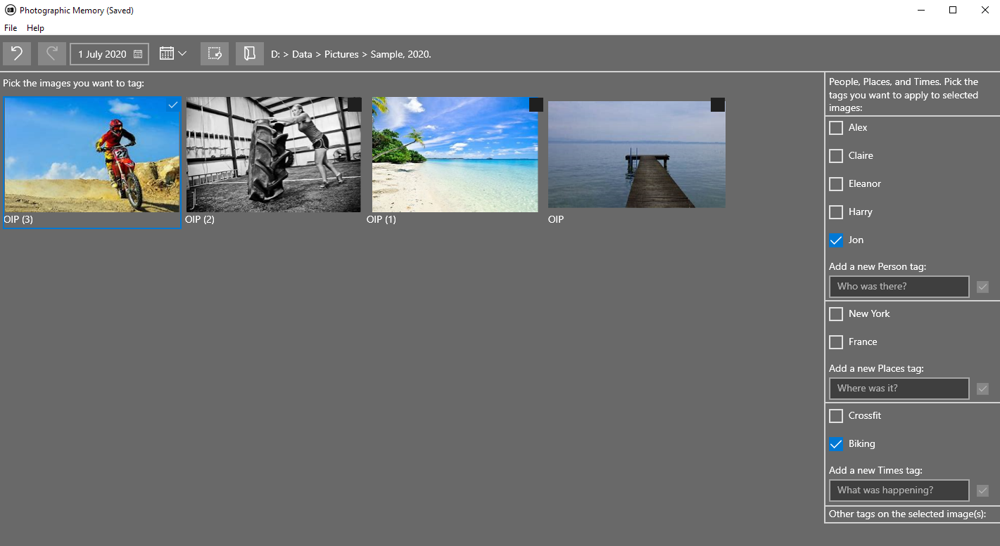

## Table of contents
* [General info](#general-info)
* [Technologies](#technologies)
* [Design](#design)
* [Installation](#installation)
* [Licence](#licence)

## General info
TXP Photographic Memory is a graphical interface that helps you manage large photo albums by adding & removing subject tags to .JPG files. 

Subject tags are metadada such as people, places, and events - 'Family Holiday', 'Jon', 'Claire', and 'France'. These subject tags are stored in the image file, so they won't get lost or separated from it even when it is sent or copied to other people or places. The user can then easly find images about a particular subject. The subject tags are stored in industry-standard fields, and most image library programs can read them, and the tags can be used to organise & share relevant parts of a large photo library. 

The same technology is available in professional image management programs, such as Adobe Bridge. TXP Photographic Memory is a free, lightweight, open source option for everyday use. 
	

## Technologies
TXP Photographic Memory is created with:
* C++ 17 
* Visual Studio Community 2019
* The Exiv2 library for reading & writing meta data.  
	
## Design
TXP Photographic Memory is composed of several different components, each of which is implemented as a separate library for development purposes:
* Host - defines & implements wrappers to operating specific calls. At some point, a Linux port will be created, and this will be the first library to change. 
* Core - has a light dependency on 'Host', but is mostly operating system independent. As much logic as possible is included here to maximise portability. Core contains the internal representation of the user's images, and commands to change the subject tags. In the 'Model View Controller' pattern, this is the Model & the Controller. This component is operating system independent. It uses & encapsulates third party libraries such as Exiv2. 
* UIWin32 - this is a shell application that creates a 'Xaml island' containing the UI. Fully windows specific. 
* UIUwp - the actual windows UI, implemented in Xaml. Fully windows specific. In the 'Model View Controller' pattern, this is the View. 
* Test - contains the test suite. 
 

## Installation

To install & build a local copy for development:
* Install Visual Studio Community 2019.  
* Use 'vcpkg' to install the Exiv2[unicode] library. 
* Open & build the 'MBrs' solution (media browser). The solution builds developer versions to the 'bindw64' directory, and release versions to 'binrw64'.

To install a version for personal use:
* Run the setup program - Setup/Release/Setup.msi

## Licence

MIT. 

The 'HostUserData' module in 'Host' library uses code derived from Giovanni Dicanio's article in the May 2017 edition of MSDN Magazine. 